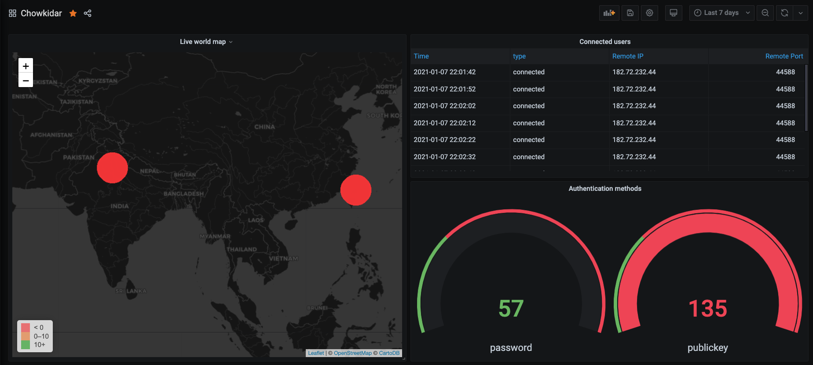

# Chowkidar 
[](https://GitHub.com/vedantrathore/chowkidar/graphs/commit-activity)
[](https://github.com/ellerbrock/open-source-badges/)
[](https://opensource.org/licenses/mit-license.php)


---

>A tool to monitor all the ssh activity in your datacenters. 



## Architecture

  

Chowkidar consists of two components:

  

-  **Agent**: This is deployed on your servers you want to monitor. Runs as a docker daemon container. It's made in python and uses [celery](https://docs.celeryproject.org/en/stable/#) and [redis](http://redis.io/) to ensure minimal data loss asynchronously.

  

-  **Server**: A central processing unit which aggergates data from all servers and displays in a [grafana](https://grafana.com/) dashboard. It's a [node](https://nodejs.org/en/) based webhook which parses the data and inserts it into a time-serires database ([Influx DB](https://www.influxdata.com/)) which is used by grafana to render the dashboards.

  

Server is deployed on [ECS Fargate](https://aws.amazon.com/ecs/?whats-new-cards.sort-by=item.additionalFields.postDateTime&whats-new-cards.sort-order=desc&ecs-blogs.sort-by=item.additionalFields.createdDate&ecs-blogs.sort-order=desc) tasks with EFS mounted storage for InfluxDB and Grafana.

  
  

## Deployment

  

### Server:

  

* Clone this repository

* Configure `AWS_ACCESS_KEY_ID` and `AWS_SECRET_ACCESS_KEY` env variables with Administrator privileges

* Create [AWS SSM secrets](https://docs.aws.amazon.com/systems-manager/latest/userguide/systems-manager-parameter-store.html) for (refer to `.env.sample`):

- INFLUXDB_USERNAME

- INFLUXDB_PASSWORD

- GRAFANA_USERNAME

- GRAFANA_PASSWORD

  

use the following command to create the secrets:

```

$ aws ssm put-parameter \

--name "/chowkidar/influx/influxdb_username" \

--value "chowkidar" \

--type "SecureString" \

  

$ aws ssm put-parameter \

--name "/chowkidar/influx/influxdb_password" \

--value "chowkidar" \

--type "SecureString" \

  

$ aws ssm put-parameter \

--name "/chowkidar/influx/grafana_username" \

--value "chowkidar" \

--type "SecureString" \

  

$ aws ssm put-parameter \

--name "/chowkidar/influx/grafana_password" \

--value "chowkidar" \

--type "SecureString" \

  

$ aws ssm put-parameter \

--name "/chowkidar/influx/ipstack_access_key" \

--value "YOUR_IPSTACK_ACCESS_KEY" \

--type "SecureString" \

```

* Setup and configure [terraform](https://www.terraform.io/) v12.28

* From the `./deployment/server` directory run:

*  `$ terraform init`

* Refer to `./deployment/server/testing.tfvars` for variable configuration

*  `$ terraform plan`

* Validate the plan and make sure everything is cool

*  `$ terraform apply`

* This will output a DNS of the public load balancer, configure it with your domain registrar.

  

### Agent

* Clone this repository

* Install and configure [ansible](https://www.ansible.com/)

* Make sure that you have SSH connectivity with the target server

*  `$ cd deployment/agent && ansible-playbook install-agent.yml -extra-vars "Deploy=fresh" -i <your inventory file>`